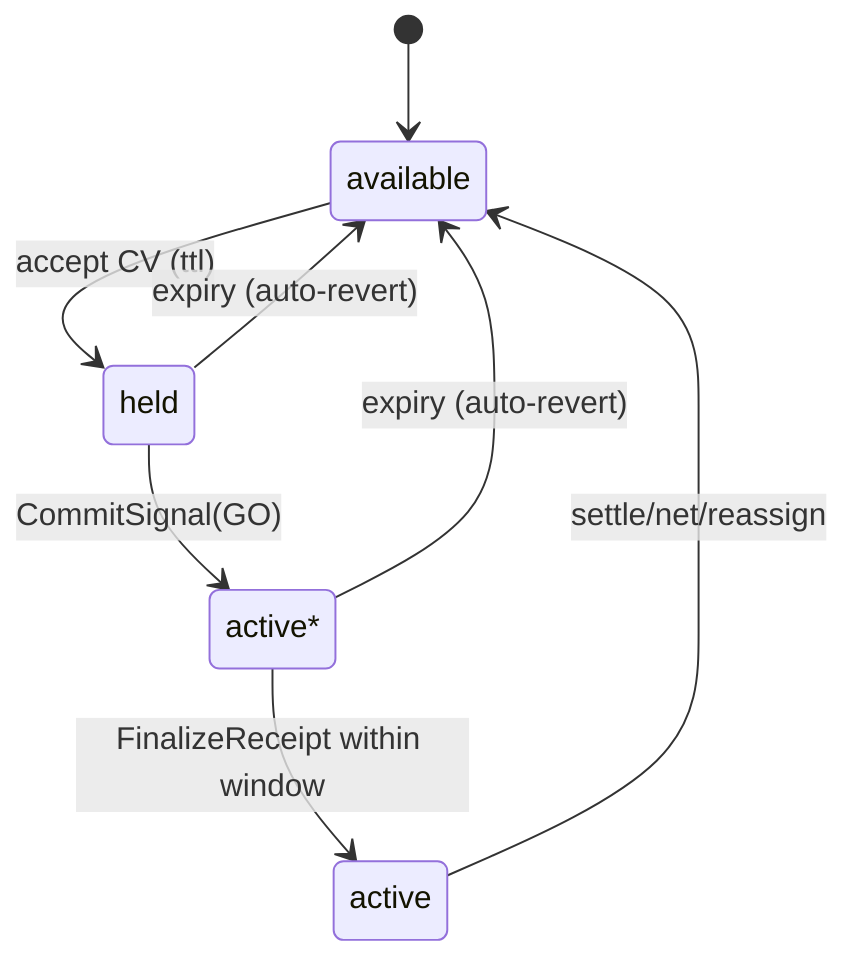
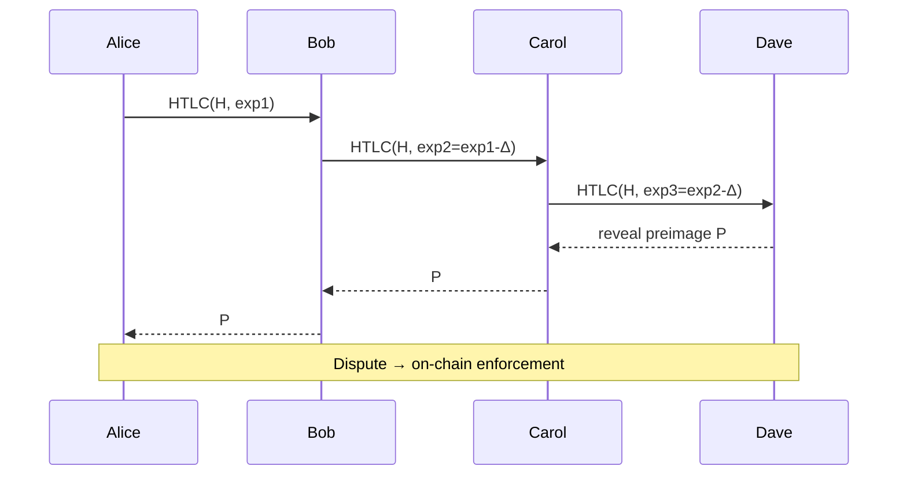
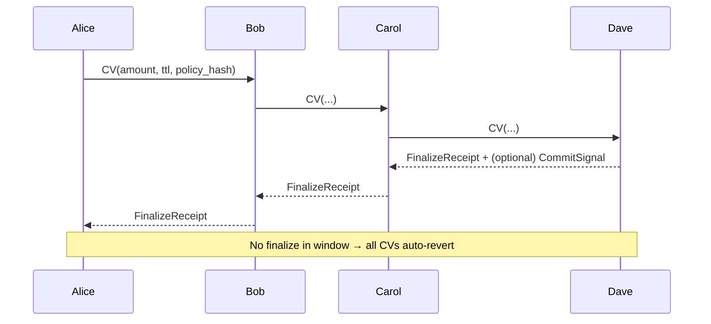
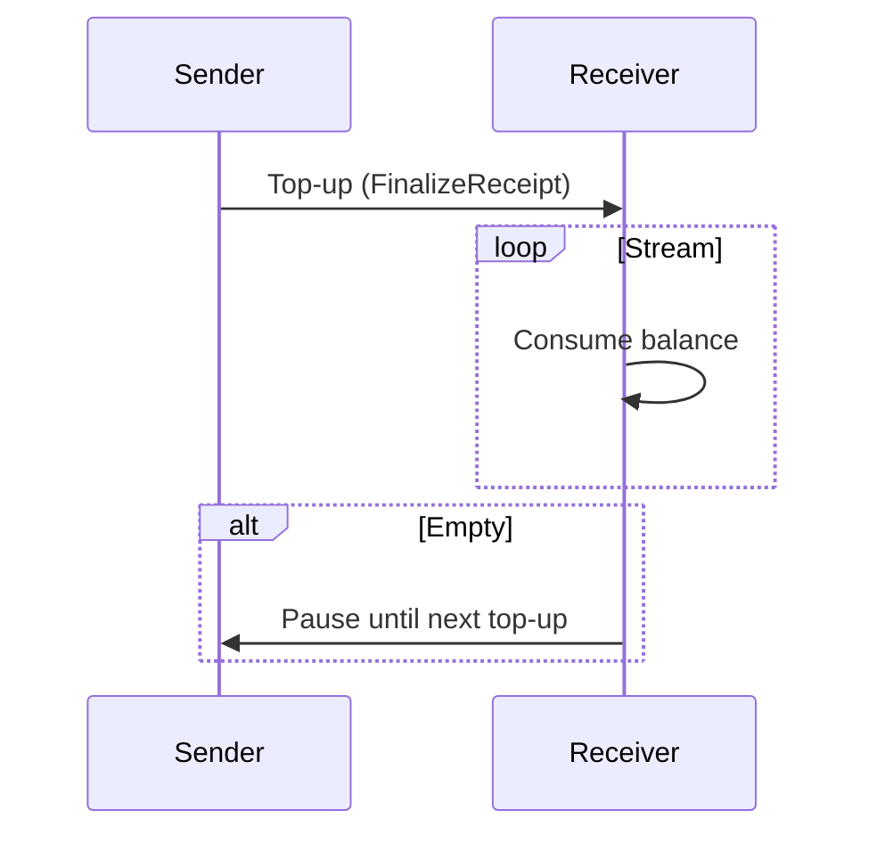
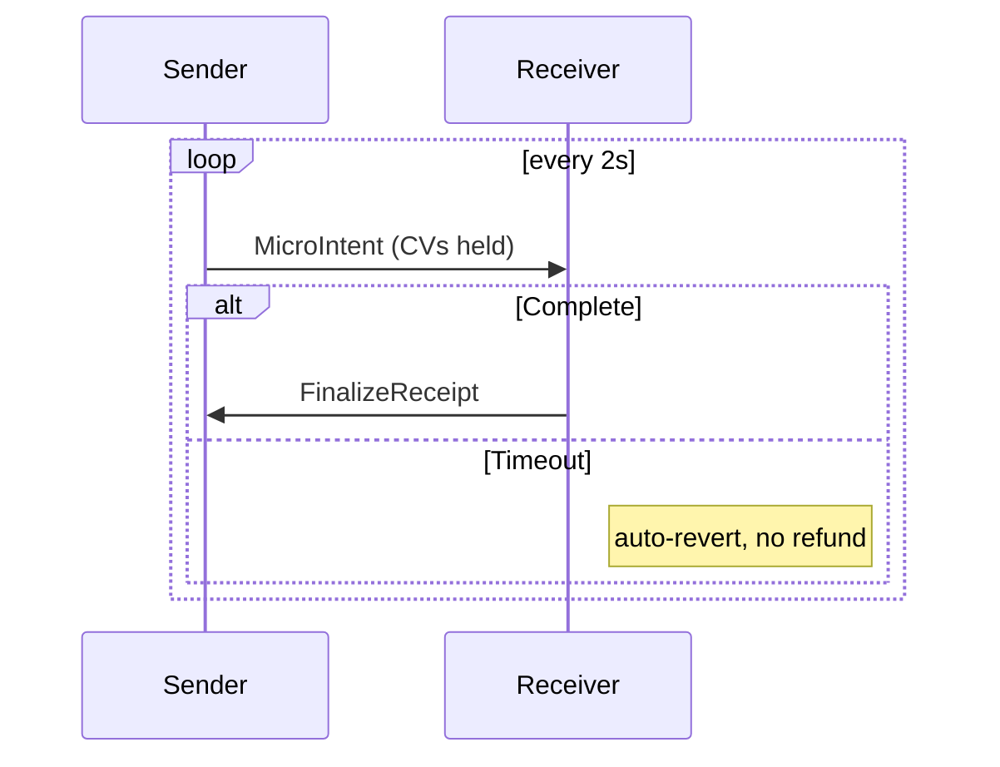
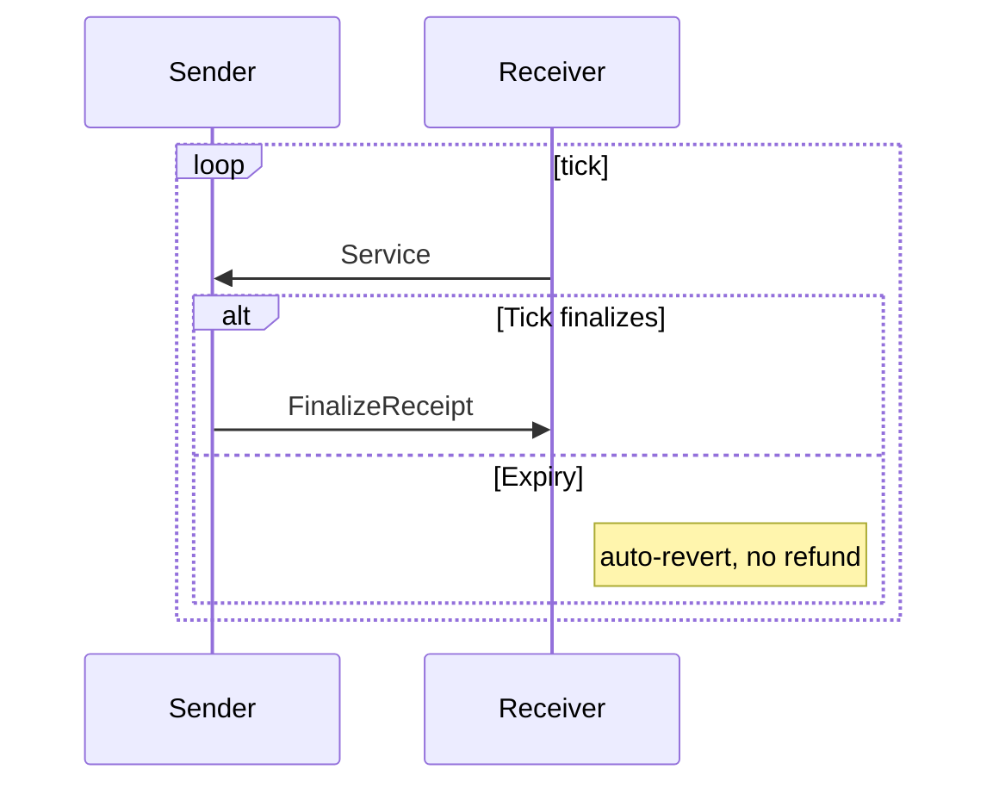

# Atomicity: A Bounded‑Trust Credit Routing Protocol

## Abstract
Atomicity is a peer‑to‑peer **credit routing** protocol that achieves safety without a global ledger or refund logic. Instead of attempting decentralized atomic commit (à la HTLCs on Lightning), Atomicity prevents unsafe states with **Conditional Activation + Auto‑Revert**: a payment either **finalizes** end‑to‑end (via a signed FinalizeReceipt from the receiver) or **reverts** automatically on expiry at every hop. The protocol supports private, empirical routing, explicit pricing, streaming payments (prepaid, micro‑window, postpaid‑tick), and optional market roles (routers, credit‑on‑demand issuers, recovery agents, netting coordinators) — all bilateral and replaceable.

---

## 1. Positioning & Design Principles

### Paradigm
- **Not a blockchain or clearinghouse.** No global state, no consensus, no custodianship.
- **Bounded‑trust fabric.** Safety from *not entering* refund/partial states.
- **Local state machines.** Commit or lapse per hop with short TTLs.
- **Explicit economics.** Fees/terms are committed in offers; mismatches are detectable.
- **Settlement externalized.** Paykit adapters (Bitcoin, LN, fiat, contracts) are optional.

### Legal design principles (guardrails)
1. **Bilateral obligations only.** Edges are A↔B with explicit limits and expiry.
2. **Bounded commitments.** Everything has TTL/expiry; auto‑revert by default.
3. **Voluntary roles.** Routers, indexers, recovery agents, CoD issuers are optional and replaceable.
4. **Subjective reputation.** No authoritative global ratings.
5. **Homeservers are mirrors.** They store signed receipts; they don’t intermediate value.

---

## 2. Model & Objects

### 2.1 Edge & States (per hop)
Each credit edge maintains a small state machine:
- `available` → free capacity
- `held` → reserved by a **CapacityVoucher (CV)** with TTL
- `active*` → conditionally active pending receiver finalize within window
- `active` → finalized debt (normal outstanding balance)

Auto‑revert from `held` or `active*` on expiry.

### 2.2 Core wire objects
- **PaymentIntent**: amount, receiver, expiry, fee/latency constraints.
- **RoutingOffer**: hop policy (fee bps/flat, limits, ttl), `policy_hash`.
- **CapacityVoucher (CV)**: reservation {amount, ttl, policy_hash, prev_receipt_id}.
- **CommitSignal (GO)**: receiver’s commit window parameters (optional, small).
- **FinalizeReceipt**: receiver’s signature binding intent → finalize.
- **HopReceipt**: each hop’s signed transition evidence (held/active*/active/expired).
- **NettingSet / NettingReceipt**: optional multilateral reassignment bundle.
- **TemporaryLimit (CoD)**: bilateral, short‑tenor limit extension (priced).

All receipts are signed; homeservers mirror them; Nexus‑like indexers may summarize.

> **Note:** PKARR is used only for discovery bootstraps (DNS‑like; ~1 KiB record cap; not for frequent updates).

---

## 3. Payment Flows (contrast with LN)

### 3.1 Lightning HTLC (reference)

### 3.2 Atomicity Finalize + Expiry

**Properties**
- No refunds, no receiver partials.
- Bounded sender loss via probe budgets.
- Failure localizes to the hop that missed finalize.

---

## 4. Routing & Fees

### 4.1 Empirical, private routing
- **Local indexes** (Nexus‑lite pulls from peers’ homeservers).
- **Probes** with tiny CVs + TTL; budgeted by `max_probe_spend`.
- **Optional neighbor‑only RoutingSignals** (coarse hints; short TTL; signed).

### 4.2 Explicit economics
- Fees are explicit in **RoutingOffer**; committed via `policy_hash`.
- **HopReceipts** include `policy_hash` → detect `fee_mismatch` automatically.
- Credit carry (interest) vs routing fee are separate knobs.

---

## 5. Streaming Payments (safe variants)

### 5.1 Prepaid Buckets (top‑up balance)

### 5.2 Windowed Micro‑Intents

### 5.3 Postpaid Ticks (trusted peers)

---

## 6. Reputation & Attestations

- Treat **FinalizeReceipt/HopReceipt** sets as attestations.
- Homeservers may publish **summaries** (counts, amount bands, success rate, latency, Merkle root of receipt IDs).  
- Privacy: summaries are coarse; raw receipts remain bilateral.  
- Optional **OTS anchoring** of daily Merkle roots for audit integrity (off fast‑path).  
- Reputation weighting: value × tenor × recency with decay; cap per origin (Sybil damping).

---

## 7. Optional Market Roles

- **Routers:** publish short‑TTL offers; compensated by explicit fees.
- **Credit‑on‑Demand (CoD) Issuers:** bilateral, short‑tenor TemporaryLimits (priced carry, haircuts, expiries).
- **Recovery Agents:** per‑intent, revocable delegation to co‑sign Finalize when receiver is briefly offline; must return proof bundle.
- **Netting Coordinators:** compute **NettingSet** proposals; participants co‑sign **NettingReceipt**; fee rule: hops whose net exposure decreases **must not** charge routing fee for that netting action (risk‑reduction is its own reward).

All roles are optional and replaceable; none is protocol‑critical.

---

## 8. Security & Economics (invariants)

- **S1 No receiver partials:** AON buffer + finalize‑only recognition.
- **S2 No refunds:** Holds/conditional activations auto‑revert on expiry.
- **S3 Bounded sender loss:** Probe budgets; per‑window caps; optional stamps/PoW for rate‑limit.
- **S4 Detectable pricing:** `policy_hash` → `fee_mismatch` tagging; reputation penalties.
- **S5 Localized failure:** The hop that misses finalize in window is attributable by receipts.
- **S6 Privacy‑preserving routing:** No global graph; optional neighbor‑hints only.

**Falsification tests**
1) Force mid‑route failure → verify auto‑revert; receiver shows no partials.  
2) Overcharge a hop → emit `fee_mismatch`; shun path.  
3) Receiver offline → no finalize → revert; no refund needed.  
4) Probe flood → loss ≤ `max_probe_spend`.  
5) Streaming lapse → window/bucket reverts without partial recognition.

---

## 9. Interop & Architecture Notes

- **Identity & Delegation:** Pubky/Ring for keys; sessions to homeserver; delegation for agents is capability‑scoped and revocable.
- **Discovery:** PKARR only for bootstrap pointers (1 KiB cap, low frequency). Do not stuff live routing data into PKARR.
- **Indexing:** Pubky Nexus‑style indexes are local and subjective; multiple independent indexers should exist.
- **Settlement:** Paykit adapters can trigger external rails on Finalize (Bitcoin, LN, fiat, DLCs, Liquid). The core remains settlement‑agnostic.

---

## 10. Related Work (design lineage)
- **Lightning Network:** bounded per‑hop risk and reverse proof flow (we adopt expiries and backward confirmations; drop HTLC mechanics/on‑chain fallback).  
- **2‑Phase Commit:** prepare/commit with timeouts → our finalize/expiry symmetry.  
- **TCP/IP:** TTL + ACK heuristics mapped to money/credit.  
- **Hawala/Clearing:** bilateral receipts, reputation, time‑bounded settlements.

---

## 11. Open Questions & Future Work
- **Pricing surfaces:** default curves for carry vs routing fee by tenor/amount.  
- **Netting game theory:** disclosure incentives and solver strategies.  
- **CoD microstructure:** auctions vs RFQ; slippage protection in tight windows.  
- **Privacy upgrades:** ZK summaries for attestations; onionized routing offers.  
- **Reference implementation:** minimal homeserver + wallet + router with falsification test suite.

---

## Appendix A — LN vs Atomicity (at a glance)

| Property | Lightning (HTLC) | Atomicity |
|---|---|---|
| Commit mechanism | Preimage + timelock deltas + on‑chain fallback | Receiver‑signed Finalize + per‑hop TTL auto‑revert |
| Refunds | Present (timeout/settle logic) | Absent by design |
| Failure scope | Local per hop, enforceable on chain | Local per hop, reputational; receipts prove fault |
| Routing | Gossip + probes | Local indexes + probes + optional neighbor hints |
| Streaming | HTLC fragments or AMP | Prepaid, micro‑windows, or postpaid ticks |
| Legal posture | Channel operators; potential MSB tangles | Bilateral, bounded commitments; subjective reputation |
