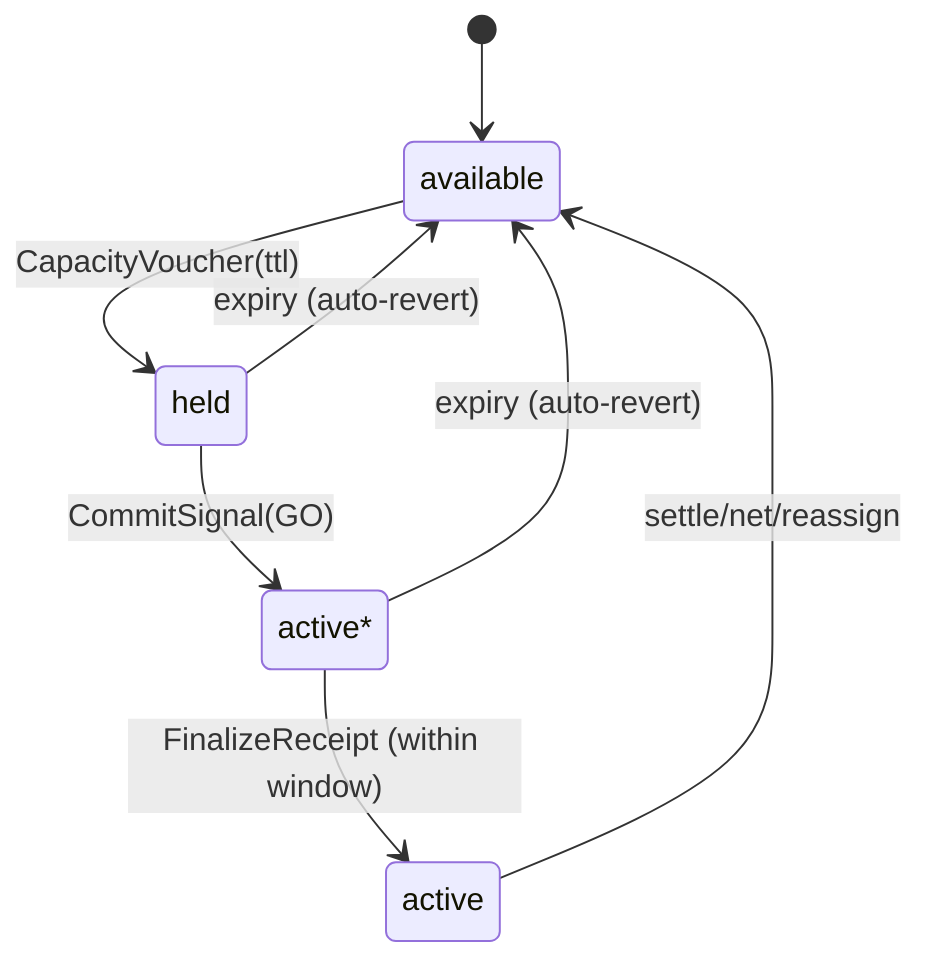
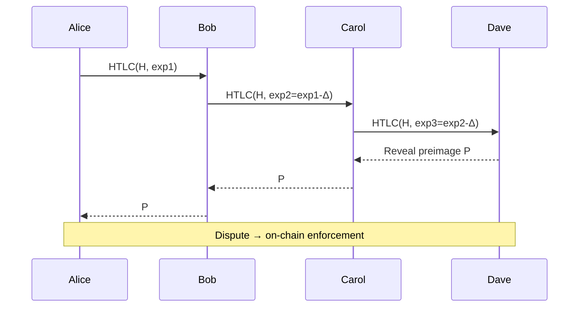
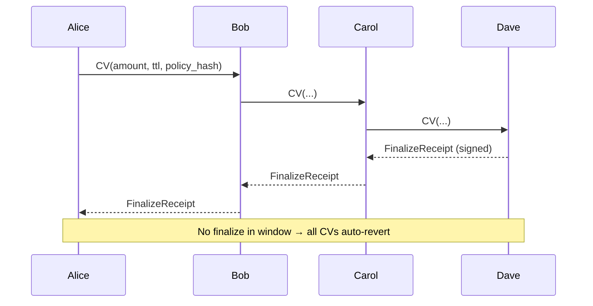

# Atomicity: A Bounded‑Trust Credit Routing Protocol for the Open Web

> **Status:** Internal Draft • **Scope:** Protocol overview, narrative motivation, and minimal technical spec

---

## Abstract
Atomicity is a peer‑to‑peer **credit routing** protocol that enables private, scalable payments **without** a global ledger, refunds, or custodians. Rather than attempting decentralized atomic commit with hashlocks and a blockchain backstop, Atomicity adopts a **bounded‑trust** model: it never enters unsafe states. Payments proceed as short‑lived reservations and only become real obligations when the **receiver explicitly finalizes** within a brief window. Otherwise, **all reservations auto‑revert**.  

This paper motivates the model, outlines the protocol, contrasts it with Lightning’s HTLC approach, and discusses economics, privacy, legal guardrails, and a path to implementation.

---

## 1. Motivation
Global ledgers are powerful—but heavy. Many real‑world transactions already rely on **bounded trust**: invoices, net‑terms, and receipts. They work because promises expire, proofs exist, and reputations matter.  
Atomicity takes these ordinary ideas—**expiry, acknowledgments, and receipts**—and encodes them into a small, ledger‑free protocol suitable for the open web.

### 1.1 Problem with “refund-first” payment designs
Refund-centric designs (e.g., HTLCs) rely on **undo paths** and often a **global arbiter** for final safety. That is costly, leaky for privacy, and fragile at scale. We instead **avoid** unsafe states in the first place.

### 1.2 Goals
- **Safety without a chain:** No refunds; no irreversible partials.  
- **Scalability via locality:** Credit and receipts are bilateral; no global state.  
- **Explicit economics:** Pricing and policies are published and provable.  
- **Composable settlement:** Bitcoin, Lightning, fiat, contracts—**outside** the core.  
- **Legal neutrality:** Tools, not institutions; roles are voluntary and replaceable.

---

## 2. Design Overview
Payments traverse a path of peers as **short‑lived reservations**. Each hop either:  
1) receives a **FinalizeReceipt** from the receiver before a small **TTL**, and activates the debt; or  
2) **auto‑reverts** to free capacity when the TTL lapses.  
No refunds exist; the receiver never holds “stuck partials.”

### 2.1 State machine (per hop)


- **available:** Free capacity on a bilateral credit line.  
- **held:** Capacity temporarily reserved by a **CapacityVoucher** (CV) with a TTL.  
- **active\***: Tentative activation after the receiver emits a lightweight **CommitSignal** (optional); awaits FinalizeReceipt.  
- **active:** Finalized debt; normal outstanding balance.

### 2.2 Flow vs. Lightning (at a glance)
**Lightning HTLC (reference):**

**Atomicity Finalize + Expiry:**


**Key differences:** No refunds; no preimages; no global fallback. Safety comes from **not entering** bad states.

---

## 3. Threat Model & Assumptions
- **Trust is bounded and local.** Each edge is a bilateral credit line with limits/tenors.  
- **Parties may go offline or misbehave.** The protocol must bound exposure and attribute failure.  
- **No honest majority assumption.** There is no global state to corrupt.  
- **Clocks are rough.** We use short **relative TTLs** and signed receipts; no strict global time sync.

**What we do *not* assume:** A blockchain backstop, a central coordinator, or globally correct routing tables.

---

## 4. Protocol Primitives
Minimal wire objects (signatures elided for brevity):

```text
PaymentIntent { id, receiver, amount, expiry, constraints{max_fee_bps, latency}, policy_hash? }
RoutingOffer  { hop, fee_bps, fee_flat, limits, ttl, policy_hash }
CapacityVoucher (CV) { intent_id, amount, ttl, policy_hash, prev_receipt_id? }
CommitSignal (optional) { intent_id, window_ms }
FinalizeReceipt { intent_id, amount, receiver_sig }
HopReceipt { intent_id, hop, state_transition, policy_hash, t, sig }
```

- **policy_hash** commits each hop to its published pricing/limits.  
- **HopReceipts** form the audit trail (held→active*→active or expiry).  
- Homeservers **mirror** receipts for their users; indexers may summarize.

---

## 5. Routing & Economics
### 5.1 Private, empirical routing
- Wallets maintain **local routing indexes** (pulling from peers’ homeservers or social tags).  
- **Probes** use tiny CVs with strict budgets (`max_probe_spend`) and TTLs.  
- Optional **neighbor‑only routing signals** (coarse success hints; short TTL; signed) improve efficiency without global gossip.

### 5.2 Explicit fees & terms
- Hops publish **RoutingOffers**; senders accept or skip.  
- **policy_hash** binds the voucher to the offer; mismatches are detectable.  
- Separate knobs: **routing fees** (service) vs **credit carry** (interest/yield).

### 5.3 Netting (optional)
Participants may periodically co‑sign a **NettingReceipt** that reassigns exposures to reduce gross balances. Hops whose risk **decreases** in a netting step should not charge a routing fee for that action (risk reduction is its own reward).

---

## 6. Streaming Payments (safe shapes)
Atomicity supports continuous value transfer **without** refunds or receiver partials:
1. **Prepaid buckets:** Sender tops up; receiver consumes; pause at zero.  
2. **Windowed micro‑intents:** Small rolling windows; finalize or revert per window.  
3. **Postpaid ticks (trusted):** Service streams; periodic finalize or lapse.

All preserve invariants: **no refunds, no partials, bounded sender loss**.

---

## 7. Security Properties & Tests
**Invariants**  
- **No receiver partials:** Value recognized only on Finalize.  
- **No refunds:** Holds revert on expiry; no “stuck money.”  
- **Bounded sender loss:** Probe budgets + per‑window caps.  
- **Attributable failure:** The hop that misses its window is evident from receipts.  
- **Detectable pricing:** `policy_hash` mismatch is provable misbehavior.

**Falsification tests**  
1) Drop Finalize mid‑route → verify auto‑revert and no receiver partials.  
2) Induce fee change at a hop → detect `fee_mismatch`.  
3) Receiver offline → lapse safely; no manual refunds.  
4) Probe flood → aggregate loss ≤ `max_probe_spend`.  
5) Streaming window lapse → no partial recognition.

---

## 8. Privacy
- No global routing graph; local indexes only.  
- Routing signals are **neighbor‑only** with coarse buckets and short TTLs.  
- Homeservers publish **summaries** (counts, bands, success %) rather than raw counterparty pairs.  
- Optional anchoring (e.g., OpenTimestamps) of daily Merkle roots for **auditability** without revealing counterparties.

---

## 9. Legal & Policy Guardrails
Atomicity is a **tool**, not a financial institution:
- **Bilateral obligations only.** No system‑wide liabilities or custody.  
- **Bounded commitments with expiry.** No open‑ended promises.  
- **Voluntary roles.** Routers, indexers, CoD issuers, recovery agents are optional and replaceable.  
- **Subjective reputation.** No authoritative global ratings.  
- **Settlement externalized.** Paykit adapters handle Bitcoin/LN/fiat/contracts outside the core.

These guardrails aim to minimize regulatory entanglement while allowing regulated entities to build on top.

---

## 10. Related Work
- **Lightning Network (HTLCs):** We keep **bounded time windows** and reverse confirmations; we drop hashlocks, refunds, and on‑chain fallback.  
- **2‑Phase Commit (databases):** Our **Finalize or Auto‑Revert** mirrors commit/abort symmetry.  
- **TCP/IP:** TTL + ACK intuition applied to value flow.  
- **Hawala/Clearing:** Bilateral receipts and reputation, now machine‑verifiable.

---

## 11. Implementation Roadmap
**Phase 1 (MVP):**  
- Minimal wallet + homeserver; CV/Finalize/HopReceipt; local probing; prepaid buckets.  
- Nexus‑lite index (pull‑only), policy hashing, fee mismatch tags.

**Phase 2:**  
- Windowed micro‑intents; recovery delegation (per‑intent, revocable); CoD bilateral offers.  
- Optional netting receipts; neighbor routing signals.

**Phase 3:**  
- Reputation summaries with decay; optional OTS anchoring; privacy hardening (ZK summaries).  
- Reference Paykit adapters (Bitcoin, LN, fiat); test suite for falsification scenarios.

---

## 12. Limitations & Open Questions
- **No global enforcement:** Disputes are bilateral and reputational.  
- **Heuristics for routing:** Efficiency vs. privacy is a tunable trade‑off.  
- **Economics:** Default curves for carry vs. fees; CoD market microstructure.  
- **Netting incentives:** Prevent gaming; align disclosures.

---

## 13. Conclusion
Atomicity is a small protocol with big reach: it treats payments as short‑lived reservations that either **finalize** or **revert**, removing the need for refunds and a global ledger. With explicit economics, private routing, and a modular settlement layer, it offers a pragmatic substrate for peer‑to‑peer finance on the open web.

---

## Appendix A — LN vs. Atomicity (table)
| Property | Lightning (HTLC) | Atomicity |
|---|---|---|
| Commit mechanism | Preimage + timelock deltas + chain fallback | Receiver‑signed Finalize + per‑hop TTL auto‑revert |
| Refunds | Present (timeout/settle logic) | Absent by design |
| Failure scope | Local per hop; enforceable on chain | Local per hop; receipts attribute fault |
| Routing | Gossip + probes | Local indexes + probes + neighbor hints |
| Streaming | HTLC fragments or AMP | Prepaid / micro‑windows / postpaid ticks |
| Legal posture | Channels; potential MSB edges | Bilateral, bounded, settlement‑agnostic |

## Appendix B — Glossary
- **CapacityVoucher (CV):** A short‑lived reservation for an amount on a hop.
- **FinalizeReceipt:** Receiver’s signed acknowledgment that activates the debt.
- **HopReceipt:** A hop’s signed state transition evidence.
- **TTL:** Time‑to‑live for reservations; expiry triggers auto‑revert.
- **policy_hash:** Commit to a hop’s published pricing/limits to detect fee mismatch.
